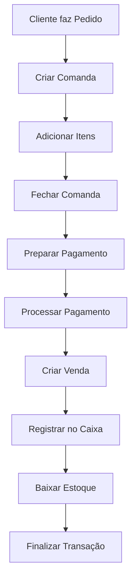

# 🍽️ RestaurantePDV - Sistema de Ponto de Venda para Restaurantes

[](https://dotnet.microsoft.com/)
[](https://docs.microsoft.com/en-us/ef/)
[](https://www.postgresql.org/)
[](LICENSE)

Um sistema completo de Ponto de Venda (PDV) desenvolvido especialmente para restaurantes, com funcionalidades robustas para gestão de comandas, vendas, caixa e estoque.

## 🎯 Visão Geral

O RestaurantePDV é uma solução moderna e escalável que digitaliza e automatiza as operações de um restaurante, desde o pedido do cliente até o controle financeiro e de estoque.

### 🌟 Principais Características

- **🏗️ Arquitetura Clean** - Baseada em DDD (Domain-Driven Design)
- **🔄 API RESTful** - Endpoints bem estruturados e documentados
- **🗄️ Entity Framework Core** - ORM moderno com migrations automáticas
- **🔐 Autenticação JWT** - Sistema de segurança robusto
- **📊 PostgreSQL** - Banco de dados confiável e performático
- **🎨 Clean Code** - Código limpo e bem documentado

## 🚀 Funcionalidades Principais

### 📋 Gestão de Comandas
- ✅ Abertura e fechamento de comandas
- ✅ Adição e remoção de itens
- ✅ Controle por mesa/cliente
- ✅ Status de preparação dos itens
- ✅ Observações e adicionais

### 💰 Sistema de Vendas e Pagamentos
- ✅ **Múltiplas formas de pagamento** (Dinheiro, Cartão, PIX, Fiado)
- ✅ **Divisão de pagamento** em uma única transação
- ✅ **Cálculo automático de troco**
- ✅ **Integração automática com caixa**
- ✅ **Validações de negócio completas**
- ✅ **Histórico detalhado de transações**

### 🏦 Controle de Caixa
- ✅ Abertura e fechamento de caixa
- ✅ Movimentações (entradas, saídas, sangrias, suprimentos)
- ✅ Conciliação automática
- ✅ Relatórios de fechamento
- ✅ Controle de diferenças (sobras/faltas)

### 📦 Gestão de Produtos e Estoque
- ✅ Cadastro completo de produtos
- ✅ Controle de estoque em tempo real
- ✅ Baixa automática nas vendas
- ✅ Alertas de estoque baixo
- ✅ Categorização por tipo

### 👥 Gestão de Pessoas
- ✅ Cadastro de clientes
- ✅ Gestão de funcionários
- ✅ Controle de acesso por perfil
- ✅ Escalas de trabalho
- ✅ Sistema de restrições

### 📈 Relatórios e Analytics
- ✅ Vendas por período
- ✅ Performance por forma de pagamento
- ✅ Movimentação de caixa
- ✅ Controle de estoque
- ✅ Análises gerenciais

## 🏗️ Arquitetura

O sistema segue a arquitetura Clean Architecture com as seguintes camadas:

```
📁 RestaurantePDV/
├── 🎮 RestaurantePDV.API/           # Controllers e configurações da API
├── 🧠 RestaurantePDV.Application/   # Lógica de negócio e DTOs
├── 🏛️ RestaurantePDV.Domain/        # Entidades e regras de domínio
└── 🗄️ RestaurantePDV.Infrastructure/ # Acesso a dados e repositórios
```

### 🔧 Tecnologias Utilizadas

- **Backend**: .NET 9, C# 13
- **ORM**: Entity Framework Core 9
- **Banco**: PostgreSQL 15+
- **Autenticação**: JWT Bearer Token
- **Documentação**: Swagger/OpenAPI
- **Arquitetura**: Clean Architecture + DDD

## 🚀 Como Executar

### Pré-requisitos

- [.NET 9 SDK](https://dotnet.microsoft.com/download/dotnet/9.0)
- [PostgreSQL 15+](https://www.postgresql.org/download/)
- [Visual Studio 2022](https://visualstudio.microsoft.com/) ou [VS Code](https://code.visualstudio.com/)

### 1. Clone o Repositório
```bash
git clone <repository-url>
cd <repository-folder>
```

### 2. Configure o Banco de Dados
```bash
# Edite a connection string em appsettings.json
# Exemplo:
"ConnectionStrings": {
  "DefaultConnection": "Host=localhost;Database=RestaurantePDV;Username=postgres;Password=suasenha"
}
```

### 3. Execute as Migrations
```bash
cd RestaurantePDV.Infrastructure
dotnet ef database update
```

### 4. Execute a Aplicação
```bash
cd ../RestaurantePDV.API
dotnet run
```

### 5. Acesse a Documentação
- **Swagger UI**: `https://localhost:7xxx/swagger`
- **API Base**: `https://localhost:7xxx/api`

## 📚 Endpoints Principais

### 🔐 Autenticação
```http
POST /api/auth/login                  # Login no sistema
```

### 👥 Clientes
```http
GET    /api/clientes                  # Listar clientes ativos
GET    /api/clientes/{id}             # Buscar cliente por ID
GET    /api/clientes/cpf-cnpj/{doc}   # Buscar por CPF/CNPJ
POST   /api/clientes                  # Criar cliente
PUT    /api/clientes/{id}             # Atualizar cliente
DELETE /api/clientes/{id}             # Desativar cliente
```

### 🍽️ Comandas
```http
GET    /api/comandas                    # Lista comandas ativas
GET    /api/comandas/{id}               # Buscar comanda por ID
POST   /api/comandas                    # Criar nova comanda
PUT    /api/comandas/{id}/fechar        # Fechar comanda
PUT    /api/comandas/{id}/cancelar      # Cancelar comanda
POST   /api/comandas/{id}/itens         # Adicionar item à comanda
DELETE /api/comandas/{comandaId}/itens/{itemId} # Remover item
```

### 💰 Vendas e Pagamentos
```http
GET    /api/vendas/{id}                         # Buscar venda por ID
GET    /api/vendas/periodo                      # Vendas por período
GET    /api/vendas/comandas-pendentes           # Comandas pendentes de pagamento
GET    /api/vendas/comanda/{id}/preparar-pagamento # Preparar pagamento
POST   /api/vendas/pagar-comanda               # Processar pagamento
POST   /api/vendas/validar-pagamento           # Validar pagamento
GET    /api/vendas/venda-comanda/{id}          # Consultar venda específica
GET    /api/vendas/relatorio-vendas            # Relatório de vendas
POST   /api/vendas/reprocessar-pagamento/{id}  # Reprocessar pagamento
```

### 🏦 Controle de Caixa
```http
GET    /api/caixa                      # Listar caixas
GET    /api/caixa/aberto               # Caixa atual aberto
POST   /api/caixa/abrir                # Abrir caixa
PUT    /api/caixa/{id}/fechar          # Fechar caixa
GET    /api/caixa/periodo              # Caixas por período
```

### 💸 Movimentos de Caixa
```http
GET    /api/movimentos-caixa/{id}      # Buscar movimento por ID
GET    /api/movimentos-caixa/caixa/{id} # Movimentos por caixa
POST   /api/movimentos-caixa           # Adicionar movimento
POST   /api/movimentos-caixa/registrar-venda # Registrar venda
```

### 📦 Produtos
```http
GET    /api/produtos                   # Listar produtos
GET    /api/produtos/{id}              # Buscar produto por ID
POST   /api/produtos                   # Criar produto
PUT    /api/produtos/{id}              # Atualizar produto
PATCH  /api/produtos/estoque           # Atualizar estoque
DELETE /api/produtos/{id}              # Deletar produto
```

## 🎨 Exemplos de Uso

### 🔐 Login
```bash
curl -X POST "https://localhost:5001/api/auth/login" \
  -H "Content-Type: application/json" \
  -d '{"username": "admin", "password": "123456"}'
```

### 💰 Processamento de Pagamento de Comanda
```json
POST /api/vendas/pagar-comanda
{
  "comandaId": 123,
  "desconto": 5.50,
  "acrescimo": 0.00,
  "observacoes": "Pagamento processado",
  "formasPagamento": [
    {
      "formaPagamento": 1,
      "valor": 50.00,
      "valorRecebido": 50.00,
      "observacoes": "Dinheiro"
    },
    {
      "formaPagamento": 2,
      "valor": 30.00,
      "numeroDocumento": "1234****5678",
      "observacoes": "Cartão Visa"
    }
  ],
  "operadorId": 1
}
```

### 📊 Resposta do Sistema
```json
{
  "id": 456,
  "numeroVenda": "VND20241210001",
  "comandaId": 123,
  "numeroComanda": "CMD20241210001",
  "valorTotal": 80.00,
  "valorPago": 80.00,
  "troco": 0.00,
  "pagamentos": [
    {
      "formaPagamento": 1,
      "formaPagamentoDescricao": "Dinheiro",
      "valor": 50.00,
      "troco": 0.00
    },
    {
      "formaPagamento": 2,
      "formaPagamentoDescricao": "CartaoCredito",
      "valor": 30.00
    }
  ]
}
```

### 🍽️ Criar Comanda
```bash
curl -X POST "https://localhost:5001/api/comandas" \
  -H "Authorization: Bearer {seu_token}" \
  -H "Content-Type: application/json" \
  -d '{
    "clienteId": 1,
    "mesa": "Mesa 05",
    "observacoes": "Cliente preferencial"
  }'
```

### 🏦 Abrir Caixa
```bash
curl -X POST "https://localhost:5001/api/caixa/abrir" \
  -H "Authorization: Bearer {seu_token}" \
  -H "Content-Type: application/json" \
  -d '{
    "valorAbertura": 100.00,
    "observacoesAbertura": "Abertura do caixa",
    "operadorAberturaId": 1
  }'
```

## 🔒 Autenticação e Autorização

O sistema utiliza JWT para autenticação com três níveis de acesso:

- **👑 Admin**: Acesso total ao sistema
- **👨‍💼 Gerente**: Operações de gestão e relatórios
- **👤 UsuarioComum**: Operações básicas do dia a dia

### Endpoints de Autenticação

```http
POST /api/auth/login
Content-Type: application/json

{
  "username": "admin",
  "password": "123456"
}
```

Resposta:
```json
{
  "token": "eyJhbGciOiJIUzI1NiIsInR5cCI6IkpXVCJ9...",
  "expiration": "2025-09-25T16:42:00Z",
  "username": "admin"
}
```

## 🔄 Fluxo Completo de Operação



## 📋 Estrutura do Banco de Dados

### Principais Entidades

- **Clientes**: Cadastro de clientes com limite de crédito
- **Produtos**: Catálogo de produtos com controle de estoque
- **Comandas**: Controle de mesas e pedidos
- **Vendas**: Registro de vendas com múltiplas formas de pagamento
- **PagamentoVenda**: Controle de múltiplas formas de pagamento por venda
- **Caixa**: Controle de abertura e fechamento de caixa
- **MovimentoCaixa**: Registro de todas as movimentações financeiras
- **Funcionarios**: Cadastro de funcionários e controle de acesso
- **MovimentoEstoque**: Controle de entrada e saída de estoque

### Relacionamentos

- Cliente → N Vendas
- Cliente → N Comandas  
- Produto → N ItensVenda
- Produto → N ItensComanda
- Comanda → N ItensComanda
- Venda → N ItensVenda
- Venda → N PagamentoVenda
- Caixa → N MovimentoCaixa
- Funcionario → N MovimentoCaixa

## 📊 Recursos Avançados

### 🔄 Integração Automática
- **Vendas ↔ Caixa**: Movimentos criados automaticamente
- **Vendas ↔ Estoque**: Baixa automática nos produtos
- **Comandas ↔ Vendas**: Conversão automática no pagamento

### 📈 Relatórios Inteligentes
- Vendas por período com filtros avançados
- Análise por forma de pagamento
- Controle de performance de produtos
- Indicadores gerenciais

### 🛡️ Validações Robustas
- Verificação de caixa aberto para vendas
- Validação de estoque antes das vendas
- Controle de permissões por operação
- Auditoria completa de transações

### 💳 Formas de Pagamento Suportadas
- **Dinheiro** (com cálculo de troco)
- **Cartão de Crédito**
- **Cartão de Débito**
- **PIX**
- **Fiado** (conta corrente)

## 🎯 Próximos Passos

- [ ] **App Mobile** para garçons
- [ ] **Dashboard Analytics** em tempo real
- [ ] **Integração com Delivery** (iFood, Uber Eats)
- [ ] **Sistema de Fidelidade** para clientes
- [ ] **Gestão de Mesas** com layout visual
- [ ] **Comandas por QR Code**
- [ ] **Integração com TEF** (Transferência Eletrônica de Fundos)
- [ ] Sistema completo de usuários e permissões
- [ ] Relatórios de vendas e estoque
- [ ] Integração com impressoras térmicas
- [ ] Módulo de delivery
- [ ] Sistema de promoções e descontos
- [ ] Backup automático de dados

## 🤝 Contribuição

1. Fork o projeto
2. Crie uma branch para sua feature (`git checkout -b feature/AmazingFeature`)
3. Commit suas mudanças (`git commit -m 'Add some AmazingFeature'`)
4. Push para a branch (`git push origin feature/AmazingFeature`)
5. Abra um Pull Request

## 📄 Licença

Este projeto está sob a licença MIT. Veja o arquivo [LICENSE](LICENSE) para mais detalhes.

## 👨‍💻 Autor

**Desenvolvedor**
- GitHub: [@lobatoremulo](https://github.com/lobatoremulo)

## 🙏 Agradecimentos

- Comunidade .NET pela excelente documentação
- Entity Framework Core pela facilidade de uso
- PostgreSQL pela confiabilidade

---

⭐ **Se este projeto foi útil para você, considere dar uma estrela!** ⭐

---

### 📋 Status do Projeto

✅ **Em Produção** - Sistema estável e completo para uso em restaurantes reais

### 🔄 Última Atualização

**Dezembro 2024** - Módulo de Vendas e Pagamentos implementado com múltiplas formas de pagamento e integração completa com caixa e estoque.

---

**Desenvolvido com ❤️ para facilitar a gestão de restaurantes e estabelecimentos alimentícios.**