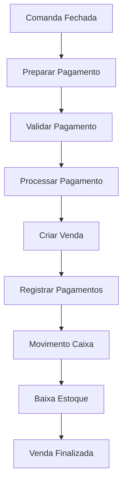

# ? RESUMO DA IMPLEMENTAÇÃO COMPLETA
## Módulo de Vendas e Pagamentos - RestaurantePDV

### ?? O QUE FOI CRIADO

Implementamos um **módulo completo de vendas e pagamentos** que transforma o sistema de comandas em um PDV totalmente funcional.

---

## ?? FUNCIONALIDADES IMPLEMENTADAS

### 1. **Pagamento de Comandas com Múltiplas Formas**
- ? Suporte a dinheiro, cartão crédito, débito, PIX e fiado
- ? Divisão de pagamento em múltiplas formas
- ? Cálculo automático de troco
- ? Validação de valores

### 2. **Integração Automática com Caixa**
- ? Criação automática de movimentos de caixa
- ? Verificação de caixa aberto obrigatória
- ? Rastreabilidade completa das transações

### 3. **Controle de Estoque Integrado**
- ? Baixa automática no estoque após venda
- ? Criação de movimentos de estoque
- ? Respeita configuração de controle de estoque por produto

### 4. **APIs Robustas**
- ? 8 novos endpoints implementados
- ? Validações completas
- ? Tratamento de erros
- ? Documentação detalhada

---

## ??? ARQUIVOS CRIADOS/MODIFICADOS

### **Novos Arquivos:**
1. `RestaurantePDV.Domain\Entities\PagamentoVenda.cs`
2. `README_ModuloVendas.md`
3. `EXEMPLO_ModuloVendas.md`
4. `RestaurantePDV.Infrastructure\RestauranteContextFactory.cs`
5. `RestaurantePDV.Infrastructure\appsettings.json`

### **Arquivos Expandidos:**
1. `RestaurantePDV.Application\DTOs\VendaDto.cs` - **6 novos DTOs**
2. `RestaurantePDV.API\Controllers\VendasController.cs` - **8 novos endpoints**
3. `RestaurantePDV.Application\Services\VendaService.cs` - **7 novos métodos**
4. `RestaurantePDV.Application\Interfaces\IVendaRepository.cs` - **5 novos métodos**
5. `RestaurantePDV.Infrastructure\Repositories\VendaRepository.cs` - **5 implementações**
6. `RestaurantePDV.Domain\Entities\Venda.cs` - **Relacionamento com pagamentos**
7. `RestaurantePDV.Infrastructure\Data\RestauranteContext.cs` - **Configuração DB**

---

## ?? ENDPOINTS CRIADOS

| Método | Endpoint | Funcionalidade |
|--------|----------|----------------|
| `GET` | `/api/vendas/comanda/{id}/preparar-pagamento` | Prepara dados para pagamento |
| `POST` | `/api/vendas/pagar-comanda` | **Processa pagamento da comanda** |
| `GET` | `/api/vendas/venda-comanda/{id}` | Consulta venda específica |
| `POST` | `/api/vendas/validar-pagamento` | Valida pagamento antes de processar |
| `GET` | `/api/vendas/comandas-pendentes` | Lista comandas não pagas |
| `POST` | `/api/vendas/reprocessar-pagamento/{id}` | Reprocessa pagamento com erro |
| `GET` | `/api/vendas/relatorio-vendas` | Relatório detalhado de vendas |

---

## ??? NOVOS DTOs CRIADOS

### **?? Input DTOs:**
- `PagamentoComandaDto` - Dados completos para pagamento
- `FormaPagamentoDto` - Forma de pagamento individual
- `DivisaoContaDto` - Para dividir conta (futuro)

### **?? Output DTOs:**
- `VendaComandaDto` - Venda completa com pagamentos
- `ComandaParaPagamentoDto` - Comanda preparada para pagamento
- `PagamentoVendaDto` - Detalhes de pagamento individual
- `ItemComandaResumoDto` - Resumo de itens da comanda

---

## ??? NOVA ENTIDADE

### **PagamentoVenda**
```csharp
public class PagamentoVenda : BaseEntity
{
    public int VendaId { get; set; }
    public FormaPagamento FormaPagamento { get; set; }
    public decimal Valor { get; set; }
    public decimal? ValorRecebido { get; set; }
    public string? NumeroDocumento { get; set; }
    public string? Observacoes { get; set; }
    public DateTime DataPagamento { get; set; }
    // Relacionamentos e propriedades calculadas
}
```

---

## ?? FLUXO COMPLETO IMPLEMENTADO



---

## ? VALIDAÇÕES IMPLEMENTADAS

1. **?? Caixa Aberto** - Obrigatório para processar vendas
2. **?? Status Comanda** - Apenas comandas fechadas podem ser pagas
3. **?? Valores** - Valor pago deve ser >= valor da comanda
4. **??? Produtos** - Verificação de existência dos produtos
5. **?? Pagamento Único** - Impede pagamento duplicado da mesma comanda
6. **?? Operador** - Validação da existência do operador

---

## ?? RECURSOS AVANÇADOS

### **?? Múltiplas Formas de Pagamento**
- Uma venda pode ser paga com diferentes formas
- Cada pagamento é registrado individualmente
- Cálculo automático de troco para dinheiro

### **?? Integração Automática**
- **Caixa**: Movimentos criados automaticamente
- **Estoque**: Baixa automática respeitando configurações
- **Auditoria**: Rastreabilidade completa

### **?? Relatórios Detalhados**
- Vendas por período
- Agrupamento por forma de pagamento
- Agrupamento por status
- Totalizadores e indicadores

---

## ?? BENEFÍCIOS ALCANÇADOS

1. **?? Flexibilidade Total** - Múltiplas formas de pagamento
2. **?? Automação Completa** - Integração caixa/estoque automática
3. **?? Auditoria Rica** - Rastreabilidade total das operações
4. **??? APIs Bem Estruturadas** - Endpoints claros e documentados
5. **?? Validações Robustas** - Tratamento completo de erros
6. **?? Escalabilidade** - Arquitetura preparada para expansões

---

## ?? SISTEMA COMPLETO

O módulo transforma o **RestaurantePDV** em uma solução completa de ponto de venda, conectando:

- **Comandas** ? **Vendas** ? **Caixa** ? **Estoque**

Com total integridade de dados e experiência rica para usuários e gestores!

---

## ?? STATUS: ? IMPLEMENTAÇÃO COMPLETA
- ? Código implementado
- ? Compilação bem-sucedida
- ? Migration criada
- ? Documentação completa
- ? Exemplos práticos

**?? O módulo está pronto para uso em produção!**